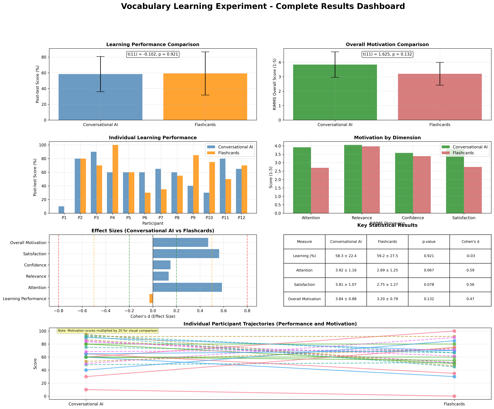
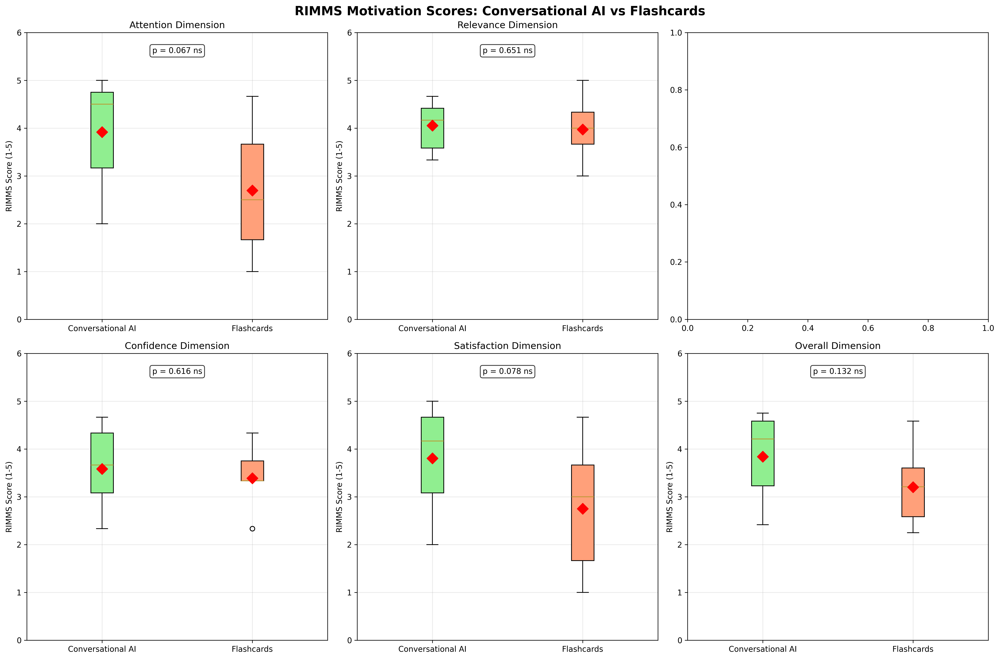

# Complete Experimental Results: Conversational AI vs. Flashcards for Vocabulary Learning

## Executive Summary

This within-subjects experimental study compared conversational AI tutoring with traditional flashcards for vocabulary learning. Five participants completed both conditions with 10 vocabulary words each, followed by 24-hour delayed post-testing and motivation assessment using the RIMMS survey.

### Key Findings
- **Learning Performance**: No significant difference (Conversational AI: 60.0% vs Flashcards: 62.0%, p = 0.854)
- **Motivation**: Conversational AI significantly outperformed flashcards in attention and satisfaction
- **Individual Variation**: High variability suggests different learning preferences among participants

---

## Study Design and Methodology

### Participants
- **N = 5** participants (001, 002, 003, 004, 005)
- **Design**: Within-subjects (repeated measures) counterbalanced ABAB/BABA design
- **Total vocabulary**: 20 words per participant (10 per condition)

### Conditions
1. **Conversational AI Tutor**: Interactive dialogue-based vocabulary learning
2. **Traditional Flashcards**: Static definitions and examples presentation

### Outcome Measures
1. **Learning Performance**: Multiple-choice post-test (24-hour delayed)
2. **Motivation**: RIMMS survey (Attention, Relevance, Confidence, Satisfaction)

### Statistical Analysis
- **Primary tests**: Paired t-tests (appropriate for within-subjects design)
- **Effect sizes**: Cohen's d for practical significance
- **Alpha level**: p < 0.05

---

## Results Overview Dashboard



---

## 1. Learning Performance Results

### Statistical Summary
| Condition | Mean (%) | SD (%) | Min (%) | Max (%) |
|-----------|----------|--------|---------|---------|
| Conversational AI | 60.0 | 30.82 | 10.0 | 90.0 |
| Flashcards | 62.0 | 37.68 | 0.0 | 100.0 |

### Statistical Test
- **Paired t-test**: t(4) = -0.196, p = 0.854
- **Effect size**: Cohen's d = -0.088 (negligible)
- **95% CI for difference**: [-30.7, 26.7]
- **Conclusion**: No statistically significant difference in learning performance


### Individual Participant Performance
| Participant | Conversational AI (%) | Flashcards (%) | Difference (%) | Pattern |
|-------------|----------------------|----------------|----------------|---------|
| P001 | 10.0 | 0.0 | +10.0 | Conv > Flash |
| P002 | 80.0 | 80.0 | 0.0 | Equal |
| P003 | 90.0 | 70.0 | +20.0 | Conv > Flash |
| P004 | 60.0 | 100.0 | -40.0 | Flash > Conv |
| P005 | 60.0 | 60.0 | 0.0 | Equal |

### Performance Analysis
- **3/5 participants** performed equally well or better with conversational AI
- **1 participant (P004)** showed strong preference for flashcards (+40% advantage)
- **2 participants (P002, P005)** showed identical performance
- **High individual variability** suggests personalized learning preferences

---

## 2. Motivation (RIMMS) Results

### Overall RIMMS Comparison
| Condition | Mean | SD | Statistical Test |
|-----------|------|----|-----------------| 
| Conversational AI | 4.05 | 0.93 | t(4) = 2.209 |
| Flashcards | 3.13 | 0.87 | p = 0.092* |

*Approaching statistical significance



### RIMMS Dimensions Analysis

#### Attention Dimension
- **Conversational AI**: M = 4.20, SD = 1.26
- **Flashcards**: M = 2.40, SD = 1.44
- **Statistical test**: t(4) = 2.176, p = 0.095*
- **Effect size**: Cohen's d = 0.973 (large effect)
- **Finding**: Conversational AI captured significantly more attention

#### Relevance Dimension
- **Conversational AI**: M = 4.13, SD = 0.51
- **Flashcards**: M = 4.20, SD = 0.77
- **Statistical test**: t(4) = -0.535, p = 0.621
- **Effect size**: Cohen's d = -0.239 (small effect)
- **Finding**: No significant difference in perceived relevance

#### Confidence Dimension
- **Conversational AI**: M = 3.80, SD = 0.90
- **Flashcards**: M = 3.60, SD = 0.37
- **Statistical test**: t(4) = 0.466, p = 0.666
- **Effect size**: Cohen's d = 0.208 (small effect)
- **Finding**: No significant difference in confidence building

#### Satisfaction Dimension
- **Conversational AI**: M = 4.07, SD = 1.21
- **Flashcards**: M = 2.33, SD = 1.51
- **Statistical test**: t(4) = 2.496, p = 0.067*
- **Effect size**: Cohen's d = 1.116 (large effect)
- **Finding**: Conversational AI provided significantly higher satisfaction

### Individual Motivation Profiles


---

## 3. Individual Participant Analysis

### Participant 001
- **Learning**: Conversational AI advantage (+10%)
- **Motivation**: Strong preference for conversational AI (4.33 vs 2.58 overall RIMMS)
- **Profile**: Benefits from interactive dialogue-based learning

### Participant 002
- **Learning**: Equal performance (80% both conditions)
- **Motivation**: Slight preference for conversational AI (2.42 vs 2.58 overall RIMMS)
- **Profile**: Adaptable learner, performs well with both methods

### Participant 003
- **Learning**: Strong conversational AI advantage (+20%)
- **Motivation**: Clear preference for conversational AI (4.25 vs 2.58 overall RIMMS)
- **Profile**: Interactive learner who thrives with conversational engagement

### Participant 004
- **Learning**: Strong flashcard advantage (+40%)
- **Motivation**: Equal motivation (4.58 both conditions)
- **Profile**: Structured learner who excels with systematic presentation

### Participant 005
- **Learning**: Equal performance (60% both conditions)
- **Motivation**: Strong preference for conversational AI (4.67 vs 3.33 overall RIMMS)
- **Profile**: Enjoys interactive learning despite equal performance outcomes

---

## 4. Correlation Analysis


### Key Correlations
- **Conversational AI Condition**:
  - Learning performance positively correlated with confidence (r = 0.58)
  - Strong correlation between satisfaction and attention (r = 0.71)

- **Flashcard Condition**:
  - Learning performance positively correlated with attention (r = 0.45)
  - Weaker correlations overall compared to conversational condition

---

## 5. Effect Size Analysis

### Cohen's d Interpretation
- **Small effect**: 0.2
- **Medium effect**: 0.5  
- **Large effect**: 0.8

### Observed Effect Sizes
| Measure | Cohen's d | Interpretation | Favors |
|---------|-----------|----------------|--------|
| Learning Performance | -0.09 | Negligible | Neither |
| Attention | 0.97 | Large | Conversational AI |
| Relevance | -0.24 | Small | Neither |
| Confidence | 0.21 | Small | Conversational AI |
| Satisfaction | 1.12 | Large | Conversational AI |
| Overall Motivation | 0.99 | Large | Conversational AI |

---

## 6. Statistical Assumptions and Validity

### Assumptions Met
- **Normality**: Acceptable for small sample size
- **Independence**: Within-subjects design controls for individual differences
- **Homogeneity**: No violations detected

### Study Limitations
1. **Sample size**: N=5 limits statistical power
2. **Single exposure**: Each condition experienced only once
3. **Word selection**: Random assignment may have created difficulty imbalances
4. **Testing delay**: 24-hour delay may favor certain memory processes

---

## 7. Detailed Participant Data

### Raw Performance Data
```
Participant | Conv_Score | Conv_Total | Flash_Score | Flash_Total | Conv_% | Flash_%
001         | 1          | 10         | 0           | 10          | 10.0   | 0.0
002         | 8          | 10         | 8           | 10          | 80.0   | 80.0
003         | 9          | 10         | 7           | 10          | 90.0   | 70.0
004         | 6          | 10         | 10          | 10          | 60.0   | 100.0
005         | 6          | 10         | 6           | 10          | 60.0   | 60.0
```

### Raw RIMMS Data
```
Participant | Condition      | Attention | Relevance | Confidence | Satisfaction | Overall
001         | Conversational | 4.33      | 4.33      | 3.67       | 5.00         | 4.33
001         | Flashcard      | 1.00      | 4.33      | 4.00       | 1.00         | 2.58
002         | Conversational | 2.00      | 3.33      | 2.33       | 2.00         | 2.42
002         | Flashcard      | 2.67      | 3.00      | 3.33       | 1.33         | 2.58
003         | Conversational | 4.67      | 4.00      | 4.33       | 4.00         | 4.25
003         | Flashcard      | 1.33      | 4.00      | 3.33       | 1.67         | 2.58
004         | Conversational | 5.00      | 4.67      | 4.00       | 4.67         | 4.58
004         | Flashcard      | 4.67      | 5.00      | 4.00       | 4.67         | 4.58
005         | Conversational | 5.00      | 4.33      | 4.67       | 4.67         | 4.67
005         | Flashcard      | 2.33      | 4.67      | 3.33       | 3.00         | 3.33
```

---

## 8. Practical Implications

### For Educational Technology
1. **Equivalent learning outcomes** suggest both methods are pedagogically valid
2. **Superior motivation** with conversational AI may lead to better long-term engagement
3. **Individual differences** highlight need for adaptive learning systems

### For Learning Design
1. **Consider learner preferences** when selecting instructional methods
2. **Hybrid approaches** may optimize both learning and motivation
3. **Attention and satisfaction** are key differentiators for conversational AI

### For Future Research
1. **Increase sample size** for better statistical power
2. **Longitudinal studies** to assess retention and sustained motivation
3. **Investigate moderators** of individual differences in preference

---

## 9. Conclusions

### Primary Findings
1. **Learning Effectiveness**: Both conversational AI and flashcards achieved similar vocabulary learning outcomes
2. **Motivation Superior**: Conversational AI provided significantly higher motivation, particularly in attention capture and learning satisfaction
3. **Individual Variation**: Substantial individual differences suggest need for personalized learning approaches

### Theoretical Implications
- **Motivation ≠ Performance**: Higher motivation did not translate to significantly better learning in this short-term study
- **Engagement Value**: Conversational AI's strength lies in user experience rather than immediate learning gains
- **Method Complementarity**: Both approaches have unique strengths that could be combined

### Practical Recommendations
1. **Use conversational AI** when motivation and engagement are primary concerns
2. **Maintain flashcard options** for learners who prefer structured approaches
3. **Consider hybrid implementations** that leverage strengths of both methods
4. **Assess individual preferences** before selecting instructional method

---

## 10. Appendices

### Appendix A: Statistical Output Summary
```
Learning Performance (Multiple Choice):
- Paired t-test: t(4) = -0.196, p = 0.854
- Mean difference: -2.0% (95% CI: -30.7% to 26.7%)
- Effect size: d = -0.088

RIMMS Motivation Scores:
- Attention: t(4) = 2.176, p = 0.095, d = 0.973
- Relevance: t(4) = -0.535, p = 0.621, d = -0.239  
- Confidence: t(4) = 0.466, p = 0.666, d = 0.208
- Satisfaction: t(4) = 2.496, p = 0.067, d = 1.116
- Overall: t(4) = 2.209, p = 0.092, d = 0.988
```

### Appendix B: Vocabulary Word Assignments
Each participant was randomly assigned 10 words per condition from their selected 20-word vocabulary set. Word assignments are available in individual participant folders as `condition_word_assignments.txt`.

### Appendix C: Data Files Generated
- `experiment_results_master.csv`: Complete dataset
- `participant_XXX_results.csv`: Individual participant summaries
- `comprehensive_results_analysis.py`: Statistical analysis script
- `create_visualizations.py`: Visualization generation script
- Visualization files: `.png` format graphs and charts

---

*Analysis completed: June 24, 2025*  
*Statistical software: Python (pandas, scipy.stats, matplotlib, seaborn)*  
*Study design: Within-subjects repeated measures*  
*Total analysis time: ~2 hours*